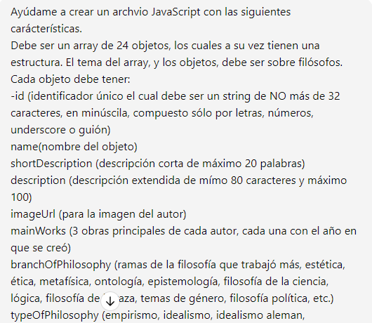
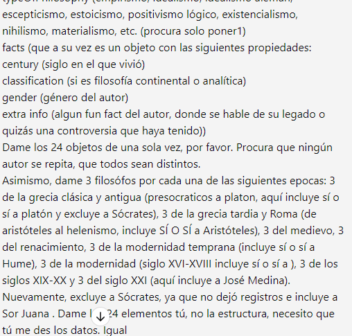
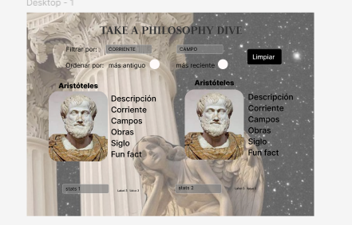
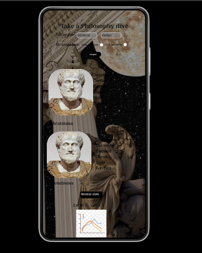

# Dataverse

## Índice

* [1. Definición del Producto](#1-definicion-del-producto)
* [2. Funcionalidades](#2-funcionalidades)
* [3. Prompting y uso de IA](#3-prompt)
* [4. Historias de Usuario](#4-historias-de-usuario)
* [5. Prototipos de Alta Fidelidad](#65prototipos)
***

## 1. 📚 Definición del Producto
*Take a Philosophic Dive* es una página web desarrollada en los lenguajes `HTML`, `Java Script` y `CSS`, cuyo principal objetivo es brindar a los usuarios un primer acercamiento a la filosofía. Se alberga en tarjetas la principal información de 24 de los filósofos más importantes a lo largo de la historia, desde Platón hasta Judith Butler. Así, las usuarias saber cuáles son las principales ramas que fueron trabajados por estos pensadores, las corrientes a las que pertenecían y las obras que marcaron su pensamiento. Del mismo modo, se cuenta con una parte de estadísticas, en donde los usuarios podrán encontrar datos de interés sobre los filósofos enlistados.

La página web está diseñada para que pueda ser consultada en diversos dispositivos, desde telefonos hasta pantallas de escritorio. Con una estructura amigable a los usuarios que les permite buscar el nombre de un pensador en especifico y filtrar de acuerdo al campo que deseen saber más.
*Take a Philosophic Dive* es un intento por seguir abonando a la difusión y divulgación de la filosofía, disciplina que nos atañe a todos y de la cual siempre se puede seguir aprendiendo.
Anímate a tomar __un clavado filosófico__ 🚀

## 2. 🔧 Funcionalidades:
Las principales funcionalidades de la página son: La visualización de los datos a modos de tarjeta, el filtrado y ordenado de la data y el cálculo de algunas estadísticas.

- __Visualización__: Se crearon tarjetas cuyos elementos cuentan con las propiedades de `microdatos` como `itemscope` `itemtype` e `itemprop`.  
- __Filtrado__: Las usuarias pueden filtrar la data mediante diversos menus desplegables `select` que corresponden a distintas propiedades. Se cuenta con un botón para las ramas de la filosofía, otro para la clasificación (analítica o continental) y otro para la corriente filosófica. Asimismo hay una `barra de búsqueda` que permite que las usuarias encuentren a un filosófo en específico sólo ingresando su nombre.
- __Ordenado__: Las usuarias pueden decidir si quieren observar la data en orden ascendente o descendiente de acuerdo al año en que haya sido cada filósofo. Para ello igualmente cuentan con un menú desplegable `select`.
- __Estadísticas__: La página muestra tres datos que se consideran de interés de acuerdo a la información mostrada: Filósofos por género, por clasificación y anteriores al siglo XIX. Se cuentan con dos gráficas para ilustrar las estadísticas de género y las de clasificación
- __Botones__: Además de las funcionalidades anteriormente enlistadas, la página cuenta con un *botón de limpieza*, el cual resetea los filtros seleccionados y vuelve a la vista original de la página. Existe un *boton de estadísticas* el cual despliega los cálculos anteriormente mencionados, un *boton de búsqueda* para la barra de búsqueda y un *boton de filtros* el cual muetra los filtros anteriormente descritos en un menu desplegable a la derecha.
- __Test Unitarios__: Para asegurar el correcto funcionamiento del filtrado, ordenado y cálculo estadísticas se desarrollaron test usando el framework `jest` que cubrieran al menos el 70% de las funciones.

## 3. Prompting:
La generación de los datos se realizo mediante la herramienta de Inteligencia Artifical `ChatGPT`de OpenAI. Mediante un prompt específico se le pidio que generara un array de 24 objetos con los `KeyElements`: id, shortDescription, description, facts, name, entre otros.
A continuación se deja el prompt utilizado:
 

## 4. Historias de Usuario:
Se crearon diversas historias de usuario para el diseño y programación de la página.

**Card:** Como persona que tiene un primer acercamiento en la filosofia quiero saber el nombre de algunos de los filosofos mas importantes de la historia, para familiarizarme con ellos.
**Criteria:** La página debe mostrar una lista de al menos 24 filósofos reconocidos.
Cada filósofo debe estar acompañado de una breve biografía.
Debe haber una imagen representativa de cada filósofo.

**Card:** Como estudiante, quiero saber algunos de los trabajos más importantes de esos filósofos, para poder buscarlos después.
**Criteria**Se deben enumerar al menos tres obras importantes de cada filosofo
Cada obra debe tener al menos el año en que se creó, el título y el tema tratado en ella.
-Opcional (poder poner links a esas obras/pdfs)

**Card:** Como estudiante, quiero saber qué filosofos trabajaron temas relacionados a x rama, pues necesito hacer una investigación sobre ese tema
**Criteria:** -La información de los filosofos debe tener las ramas a las que se dedicaron.
-Debe haber un botón de filtrado que permita filtrar por rama de la filosofia y muestre todos los filosofos que se dedicaron a ello.

**Card:** Como estudiante, quiero saber qué filosofos pertenecieron a x corriente, pues estoy interesandome en saber más sobre ésta
**Criteria:** Función de filtrado que permita conocer qué filosofos se dedicaron a x corriente
La información de los filosofos debe destacar esta información

**Card:** Como profesional de la filosofia quiero saber cuántos filosofos son de la rama continental, pues quiero conocer más sobre esa corriente 
Como usuaria primeriza, quiero saber cuántas mujeres filosofas hay y cuáles fueron sus principales intereses
**Criteria:** Funciones de calculo que permitan saber más sobre esta información y que muestre gráficas.

**Card:** Como usuaria de la página, quiero que los filtros se encuentren en una sección donde sea facil distinguirlos y en donde no tomen demasiado espacio para no hacer mucho scroll
**Criteria:** Realizar un menu lateral desplegable en donde se almacenen los filtros

## 5. 🖼️ Prototipos de alta fidelidad:
Con base en las Historias de usuario anteriormente descritas se crearon dos prototipos de alta fidelidad, los cuales sirvieron como guía para la creación de la página web, aunque se realizaron algunas modificaciones sobre estos al momento de realizar el diseño final, principalmente en la cuestión de colores. No obstante, el acomodo de los elementos y visualización de datos siguio esta estructura.
 

Coded by Alhelí De Vicente García❤️